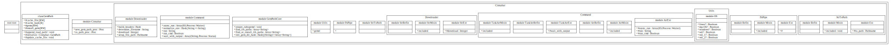

# Cinnabar

专为 CI 流程打造的工具集。

---

| Language/語言                   | ID         |
| ------------------------------- | ---------- |
| 简体中文                        | zh-Hans-CN |
| [English](./Readme.md)          | en-Latn-US |
| [繁體中文](./Readme-zh-Hant.md) | zh-Hant-TW |

---

## 前言

**问：为何取名为 Cinnabar（朱砂）？**

**答：**

1.  朱砂是中国古代道教炼丹师在炼丹时使用的一种原料，就像这个项目在 CI 工作流中充当一种“原料”。
2.  朱砂有毒。这个项目是为了 **猛、糙、快** (a.k.a. *Dirty and Quick*) 的目的而开发的，可能会产生意料之外的副作用（它并非完全无害）。
3.  朱砂是一种硫化汞 (HgS) 的矿物，呈深红色，而 Ruby 也是一种深红色的宝石。给一个 Ruby 项目取名为 “Cinnabar（朱砂）” 非常贴切。

## API DOC

- Github Pages: <https://2moe.github.io/cinnabar>

- 详见[英文文档](./Readme.md)
